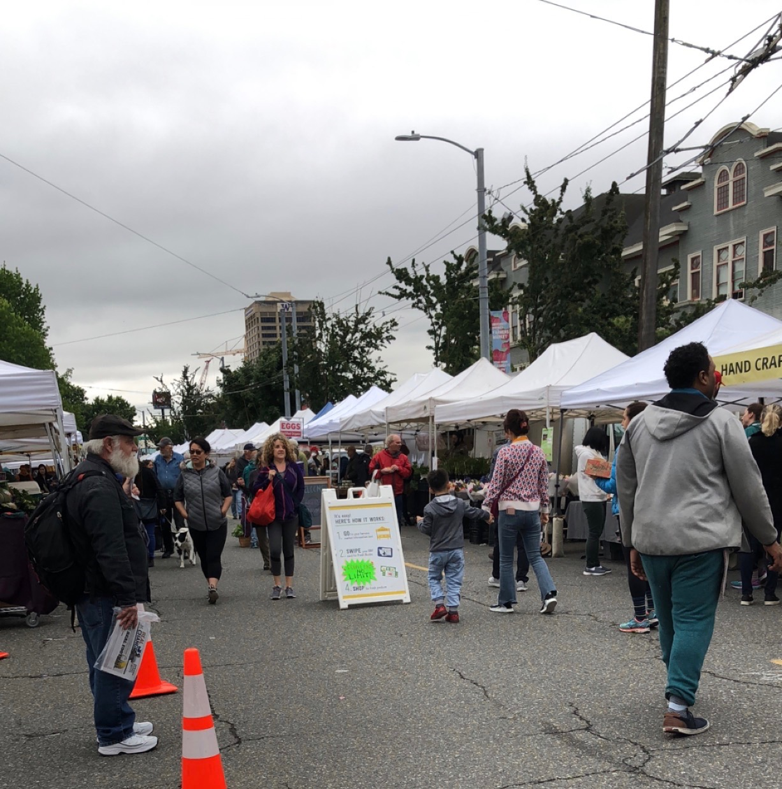
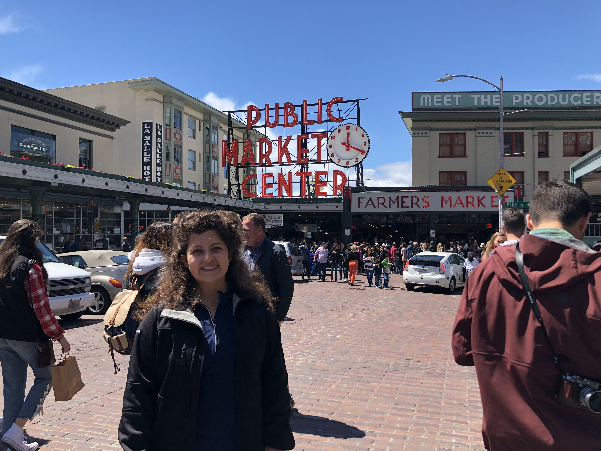

## CRA-W DREU Summer 2018 at the University of Washington

As part of the 2018 [CRA-W DREU](https://cra.org/cra-w/dreu/) program, [Olivia Richards](https://livkrichards.wixsite.com/mysite) was matched with [Dr. Julie Kientz](http://faculty.washington.edu/jkientz/) at the University of Washington, in the department of Human Centered Design and Engineering. Dr. Kientz studies Human-Computer Interaction, Ubiquitous Computing, and Health Informatics and is passionate about the intersection of those fields with healthy living and learning.

Olivia is a rising senior Mathematics student at the Pennsylvania State University, in University Park, Pennsylvania. She plans to complete her Bachelor's degree in Mathematics in May 2019 to then obtain her Ph.D. in Human-Centered Design and Computing from another research institution. 

### Connect with Olivia
Email: orichards at psu dot edu

[LinkedIn](https://www.linkedin.com/in/richardsolivia/)

### Blog: *Leasons Learned*

Blog Date | Blog
-------------------| -------------------- 
0:    **6/3/18**    | I was confused as to how one can tar file all of the files from a repository which is a requirement of the program for the 2nd stipend. I clicked a random 2017 DREU participants website. I noticed that she used a github repository as her host. I saw that she left her contact information on the web page and decided to reach out. Why not, right? The worst that’ll happen is that she wouldn’t respond.  She responded immediately. “Okay, so if you have a Mac, go where you store the folder with all your website documents. Do you know how to use terminal? If so, change to the location where this folder is, and run this command: tar czf folder_name.tar folder_name   This will create a tar file of all your documents.” This was incredibly helpful. Thank you Sarah!  (before stepping foot in WA): *Don’t be afraid to ask for help. Reach out to others when you are unsure of something and have Google searched yourself. Try new things, even if they are scarily full of code.*
1:   **6/8/18**    |   Well, my official first blog begins as I just moved to Seattle from Pennsylvania. After taking 3 trips to Target, Safeway and Walgreens on my move-in day, I recommend that *when you plan for a temporary move and you think you have planned your packing lists enough, continue to plan/pack more*! At the airport for my 5:40am EST flight, my two suitcases weighed in at 45 lbs each...little did I know, that wouldn’t be enough.    *Stay awake as long as possible on your first day of a dramatic time change. Don’t knock yourself down for being tired in the first few days of that time change because your body needs to adjust.*  **Moving to UW:** At the University of Washington, the gym allowed me to be a “Special Circumstance” to obtain a student gym membership for the summer at only $87 (which, believe it or not, is very affordable in this town). After prior research and an email from my professor/research mentor to the UW Rec Center (recinfo@uw.edu), I was able to obtain this pass. Mental and physical health, as well as wellbeing is important to maintain throughout the summer! Also, *Seattle is quite cold at night in June*. It drops to around 50 degrees every night. And, coming from someone who only packed sheets and no comforter/blanket for the summer, *pack or mail a comforter!*   **Research:** As expected, a ton of amazing work is not only being done in the DUB group at the University of Washington which combines the iSchool, Human Centered Design and Engineering department, the design department and the Computer Science department, but just within the lab of my research mentor, Dr. Julie Kientz. Thus, after discussing a summer plan, I didn’t quite choose one specific project since so many projects appealed to my diverse interests in health, design, innovation and family informatics. She has several incredible students and I spent the first two days reading their most recent papers to further assess my interest in their projects including: Incloodle, BabySteps and Family Sleep Informatics. Additionally, on my first day, I had the opportunity to attend Dr. Daniel Epstein’s defense talk on Everyday Personal Informatics. This was especially interesting to me because of my passion for the technologies that allow consumers to track and share their data from weight loss journeys to running maps. *Attend talks and sessions whenever you can.*                             **Weekend:** This weekend I attended the University District Farmers Market, which is held weekly on Saturday’s from 9am-2pm. Additionally, I finally had the opportunity to visit the Amazon Go store to see cutting edge technology at work and checked out Pike Place Market and the surrounding area! 
2:    **6/15/18**    | Throughout my first full week, I explored a research topic that I'd like to work on this summer, surrounding the presence of sociable robots in family homes with children aged 4-12. Previous work seems to not focus on low SES populations and I'm interested in the way that those families interact with the devices at home, and how they feel about the possibility of their children anthropomorphizing Alexa or Jibo at a young age. I'm interested in exploring parent's perspective on privacy with AI devices throughout their home and how invasive they are willing to allow sociable robots to be in the home of young children. 
